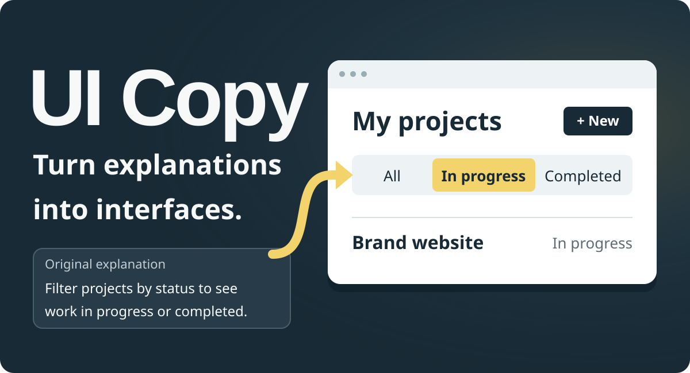
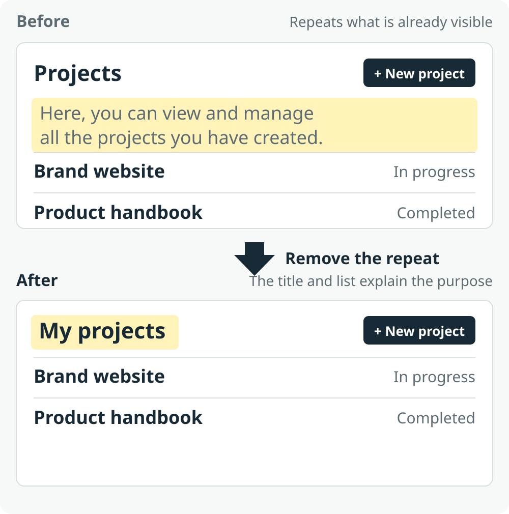
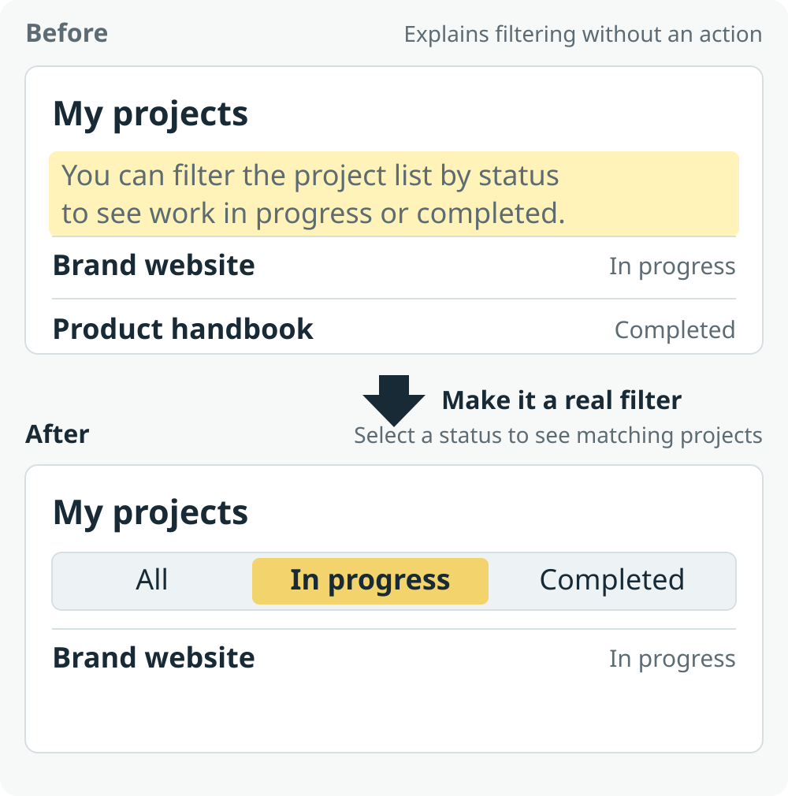
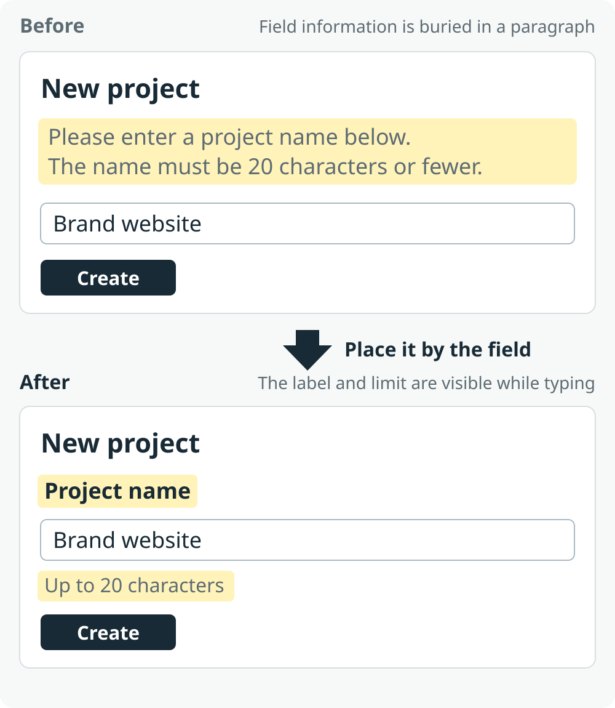

[Simplified Chinese](README.md) · [English](README.en.md)

<p align="center">
  <picture>
    <source media="(max-width: 600px)" srcset="./assets/readme/en/hero-mobile.svg">
    
  </picture>
</p>

# UI Copy

**Reduce lengthy explanations in AI-built pages. Put essential information back in the interface.**

When AI builds a page, it often adds paragraphs to introduce features, explain actions, or fill empty states. UI Copy helps you decide what to remove, what to shorten, where information belongs, and what a working interaction can express more clearly. The result is a simpler, clearer, more refined page.

[Skill instructions](SKILL.en.md) · [Examples](references/patterns.en.md) · [English wording](references/en.md) · [MIT](LICENSE)

## The page problems it solves

These before-and-after examples use the same projects and form to show how explanations can become part of the interface. Warm yellow highlights redundant text or the new location of essential information. The images are hand-drawn interface illustrations; the interactions still need to be implemented in a real project.

### A short title is enough



**Before:** A full sentence says, "Here, you can view and manage all the projects you have created." It takes up space without adding anything beyond the title and list.

**After:** Use **My projects** as the title and show the list directly below it. Project names, statuses, and the New project action already explain what people can do here. They do not need to read an introduction first.

### An explanation becomes a direct action



**Before:** Text says that projects can be filtered by status, but people still have to find a way to do it. An explanation without a usable action does not solve that problem.

**After:** Place **All / In progress / Completed** filters beside the list. Selecting In progress shows only projects with that status. The controls express the available choices; the updated list shows the result. Together, they do the work of the explanation.

When page implementation is authorized and status data is available, connect the filtering behavior and verify the result. For a review-only task, describe the specific interaction to add.

### Essential information belongs where it is needed



**Before:** The field name and character limit are buried in a paragraph at the top of the form. People have to look back to check what the field is for and what it accepts.

**After:** Put **Project name** above the input and **Up to 20 characters** below it. Both pieces of information remain available, each where it is useful. Less common help can appear on demand through a clear action such as View help.

## Four ways to handle explanations

These approaches can be combined. The goal is to help people understand a page, find information, and complete their task. It is not to make every sentence as short as possible. When an explanation is needed, explain it clearly.

### 1. Remove repetition: do not introduce what is already visible

Check whether the title, buttons, list, and current state already convey the same information. If My projects is followed by a project list, "View and manage your projects here" adds nothing and can be removed.

The test is whether people can still understand where they are and what they can do. Do not remove necessary conditions, consequences, or recovery guidance just to make a page look cleaner.

### 2. Shorten the wording: use a familiar word or phrase for the same meaning

When text is really naming an object, action, or state, use the corresponding short expression. Name the page My projects, label the action New project, and show the state In progress, rather than introducing each with "You can use this page to..."

Keep the meaning and object clear. A slightly longer phrase that everyone understands is better than a shorter one that makes people guess. Important explanations do not need to be forced into labels.

### 3. Put information in place: keep what matters, close to its context

Place field names beside fields, input requirements where people enter data, errors where they occur, and conditions that affect a decision before the action. A project name and its character limit belong with the input, rather than in a paragraph at the top of the page.

Help needed only occasionally can appear through a clear link, disclosure, or detail view. Costs, permissions, and irreversible consequences must be visible before the decision; do not hide them in details for the sake of a cleaner page.

### 4. Turn it into an interaction: let people act and see the result

When text explains how to search, filter, switch, or add something, check whether the page can provide the control directly. Replace an explanation about viewing projects by status with filters beside the list, so a selection immediately produces the corresponding result.

The interaction must work: a filter updates the list, a button performs the action it promises, and the result provides useful feedback. If the task only authorizes a review, specify the control, its location, and what should happen after use. A row of decorative buttons cannot replace an explanation.

Preserve task data, necessary notices, and recovery information. A simpler page should be easier to understand and operate, without hiding critical conditions or relying on obscure icons or gestures.

## Quick start

### Install with the skills CLI (recommended)

Run this in your project directory:

```bash
npx skills add ZGY949/ui-copy
```

Follow any prompts to choose your AI tool. Installation is project-scoped by default. Add `-g` to install to your personal skills directory for use across projects.

This command requires Node.js and npm, which includes npx. See the [skills CLI documentation](https://skills.sh/docs/cli) for more options.

### Install manually

For a personal Codex installation:

**macOS / Linux**

```bash
mkdir -p ~/.agents/skills
git clone https://github.com/ZGY949/ui-copy.git ~/.agents/skills/ui-copy
```

**Windows PowerShell**

```powershell
New-Item -ItemType Directory -Force -Path "$env:USERPROFILE\.agents\skills" | Out-Null
git clone https://github.com/ZGY949/ui-copy.git "$env:USERPROFILE\.agents\skills\ui-copy"
```

If the skill is already installed, update the existing directory rather than installing a second copy. The skill itself consists of Markdown and YAML; it needs no API key or additional runtime dependency.

### Example prompt

```text
Use $ui-copy to simplify this project list page.
Reduce explanatory paragraphs and put essential information where it belongs.
The list already has status data: replace the filtering explanation with working status filters.
Preserve the existing business rules and necessary notices.
```

<details>
<summary>Other tools and installation locations</summary>

| Tool | Personal skills directory | Project skills directory |
|---|---|---|
| Codex | `~/.agents/skills/ui-copy/` | `.agents/skills/ui-copy/` |
| Claude Code | `~/.claude/skills/ui-copy/` | `.claude/skills/ui-copy/` |

`~` represents your home directory. Keep the complete ui-copy directory, with SKILL.md directly inside it. In Claude Code, use `/ui-copy`; tools that select skills automatically can also choose it from your task description.

Installation behavior depends on your tool and version. See [OpenAI Docs](https://learn.chatgpt.com/docs/build-skills) and the [Claude Code documentation](https://code.claude.com/docs/en/skills). Other tools that support SKILL.md use their own discovery rules; execution has not been verified separately in every tool.

</details>

## Scope and contributions

Use this skill to build, revise, or review websites, apps, mini programs, and admin interfaces. A review, a copy edit, and an implementation each follow their own authorized scope. New business rules, external services, permissions, and costs remain subject to the project's boundaries.

Preserve articles, educational material, and user content according to their purpose. Less common help can appear on demand; information that affects the current decision must remain visible where it is needed.

Contributions are welcome: share a page with lengthy explanations, the real task people need to complete, and the capabilities already available. See the [source notes](references/sources.en.md) for the writing references.

## License

[MIT](LICENSE) · Copyright (c) 2026 UI Copy contributors. Third-party guides, brands, and assets linked here are not relicensed by this project.
