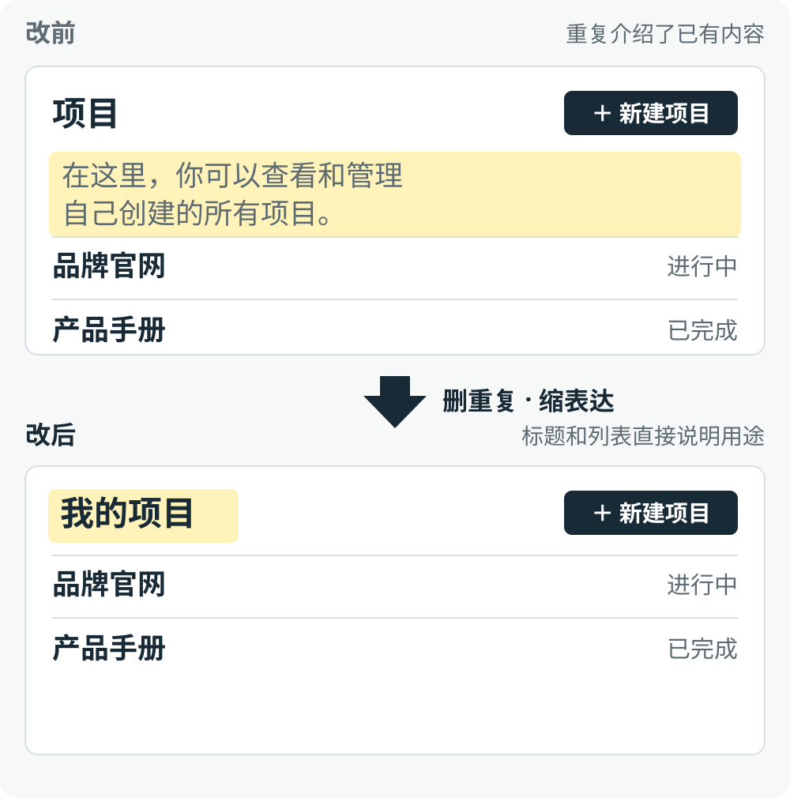
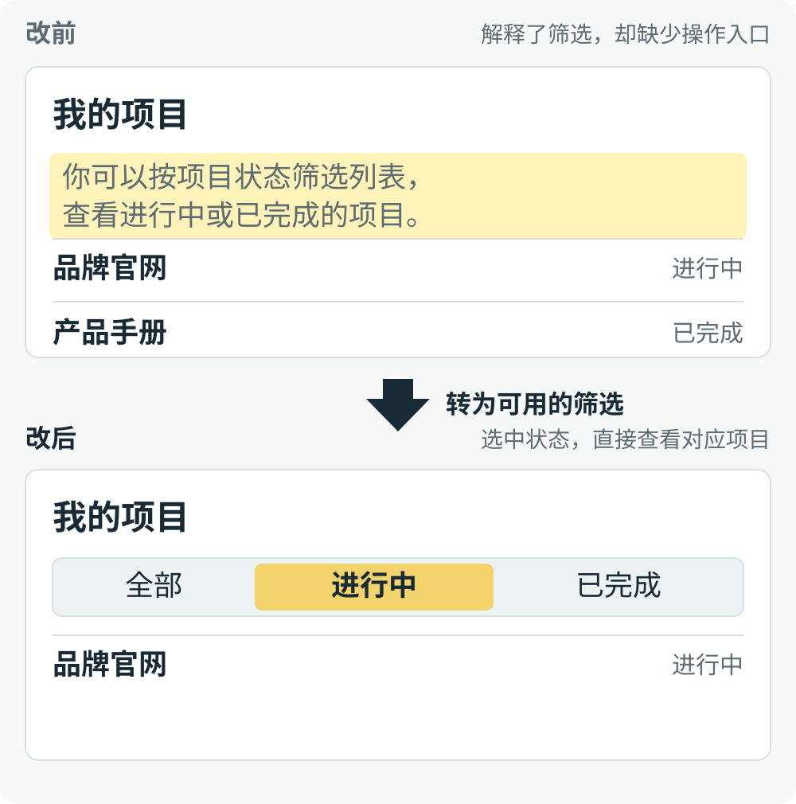
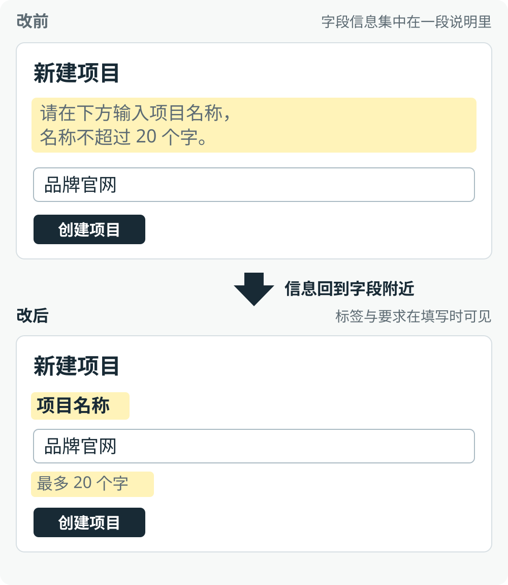

<p align="center">
  <picture>
    <source media="(max-width: 600px)" srcset="./assets/readme/hero-mobile.svg">
    
  </picture>
</p>

# UI Copy

**减少 AI 页面里的冗长说明，把必要信息放回界面。**

AI 做页面时，常用长段文字介绍功能、解释操作、填满空态。UI Copy 帮你决定这些文字该删、该缩、该放在哪里，以及哪些更适合由交互表达，让页面简洁、清楚、精致。

[技能正文](SKILL.md) · [处理示例](references/patterns.md) · [中文表达](references/zh-cn.md) · [MIT](LICENSE)

## 它解决这样的页面问题

下面用同一组项目和表单做改前／改后对照，说明文字如何回到界面。暖黄色标出需要处理的文字或新的信息位置。图片是人工绘制的页面示意，完整的交互仍需要在具体项目中实现。

### 一个短语就够



**改前：** 页面用一整句话介绍“在这里，你可以查看和管理自己创建的所有项目”，占了空间，却没有提供标题和列表之外的新信息。

**改后：** 用 **“我的项目”** 作为标题，下方直接展示列表。用户看到项目名称、状态和新建入口，就能理解这里可以做什么，不必先读一段介绍。

### 解释变成直接操作



**改前：** 文字告诉用户“可以按项目状态筛选”，但用户仍然需要寻找筛选入口。只有说明、没有方便的操作时，这段文字也解决不了问题。

**改后：** 在列表附近提供 **“全部／进行中／已完成”** 筛选项。选中“进行中”，列表就只显示进行中的项目。选项说明可以做什么，列表变化说明操作结果，两者共同承担原来的解释。

页面实现范围明确、状态数据已可用时，要接好筛选逻辑并验证结果；只做评审时，给出具体交互建议。

### 必要信息放对位置



**改前：** 字段名称和字数限制都挤在表单顶部的一段说明里。用户开始填写后，还要回头确认输入框是什么、有什么要求。

**改后：** 将 **“项目名称”** 放在输入框上方，将 **“最多 20 个字”** 放在输入框下方。必要信息仍然保留，只是各自出现在用户需要的位置；不常用的补充说明，可以通过“查看说明”等明确入口按需展开。

## 四种处理

这四种方式可以组合使用。目的不是让每句话都尽可能短，而是让用户更容易看懂页面、找到信息并完成操作。需要解释的内容，就把它解释清楚。

### 1. 删重复：已经看得出来的事，不再介绍一遍

先看标题、按钮、列表和当前状态是否已经表达了这段文字的意思。例如，“我的项目”下面已经有项目列表，再写“在这里查看和管理项目”就没有增加信息，可以删除。

判断的关键是：删掉后，用户是否仍然知道这里是什么、可以做什么。如果会丢失必要条件、操作后果或恢复方法，就不能只为了清爽而删除。

### 2. 缩表达：用熟悉的词或短语，说清同一件事

当一段文字真正承担的是命名、动作或状态，就使用对应的简短表达。例如，用“我的项目”命名页面，用“新建项目”标明操作，用“进行中”表示状态，不必写成“你可以在这里……”。

精简之后，含义和对象仍然要明确。比起字数更少但让人猜的词，稍长一点、人人都能理解的表达更合适；重要的解释也不需要硬缩成短语。

### 3. 放对位：保留必要信息，让它出现在需要的位置

字段名称放在字段旁，输入要求放在填写处，错误提示放在出错处，影响决定的条件放在确认操作之前。例如，项目名称和字数限制应该跟着输入框，而不是集中写在页面顶部。

只在少数情况下才需要的帮助，可以通过清楚的入口按需展开。但费用、权限、不可撤销的后果等影响当前决定的信息，需要提前可见，不能为了页面简洁而藏进详情。

### 4. 转交互：让用户直接操作，并看见结果

当文字在解释怎样搜索、筛选、切换或添加时，检查页面能否直接提供相应控件。例如，把“按状态查看项目”的说明变成列表旁的状态筛选，让用户选完就看到对应结果。

交互必须真的可用：筛选要更新列表，按钮要完成它承诺的动作，操作后要有必要的反馈。如果当前范围只允许评审，就说明应增加什么控件、放在哪里、操作后发生什么；不能用一排没有行为的按钮代替说明。

保留任务数据、必要告知和恢复信息。简洁应让用户更容易理解与操作，不能靠隐藏关键条件、难发现的图标或空有外观的按钮。

## 快速开始

以 Codex 个人安装为例：

**macOS / Linux**

```bash
mkdir -p ~/.agents/skills
git clone https://github.com/ZGY949/ui-copy.git ~/.agents/skills/ui-copy
```

**Windows PowerShell**

```powershell
New-Item -ItemType Directory -Force -Path "$env:USERPROFILE\.agents\skills" | Out-Null
git clone https://github.com/ZGY949/ui-copy.git "$env:USERPROFILE\.agents\skills\ui-copy"
```

已安装时更新现有目录，避免重复安装同名技能。技能本体由 Markdown 与 YAML 构成，无需 API Key 或额外运行依赖。

```text
用 $ui-copy 精简这个项目列表页。
减少解释性段落，整理必要信息的位置。
列表已有状态数据，把筛选说明改成可用的状态筛选。
保留原业务规则和必要告知。
```

<details>
<summary>其他工具与安装位置</summary>

| 工具 | 个人技能目录 | 项目技能目录 |
|---|---|---|
| Codex | `~/.agents/skills/ui-copy/` | `.agents/skills/ui-copy/` |
| Claude Code | `~/.claude/skills/ui-copy/` | `.claude/skills/ui-copy/` |

`~` 表示用户主目录。保留完整的 `ui-copy` 目录，确保 `SKILL.md` 位于目录下。Claude Code 可用 `/ui-copy`；支持自动选择的工具也可按任务描述调用。

安装方式以 [OpenAI Docs](https://learn.chatgpt.com/docs/build-skills) 和 [Claude Code 文档](https://code.claude.com/docs/en/skills)及所用版本为准。其他支持 `SKILL.md` 的工具按其发现机制安装；尚未逐一完成跨工具运行验证。

</details>

## 适用范围与贡献

用于制作、修改或评审网站、App、小程序和后台页面。只读评审、文案修改与页面实现分别遵循各自授权范围；涉及新业务规则、外部服务或费用时按项目边界处理。

文章、知识正文和用户内容按其内容目标保留。少见的帮助可以按需出现，影响决定的关键条件仍须就地可见。

欢迎提供有冗长说明的页面、实际任务与行为前提。参考依据见[来源说明](references/sources.md)。

## 许可证

[MIT](LICENSE) · Copyright (c) 2026 UI Copy contributors。链接中的第三方指南、品牌与资产不随本许可证重新授权。
